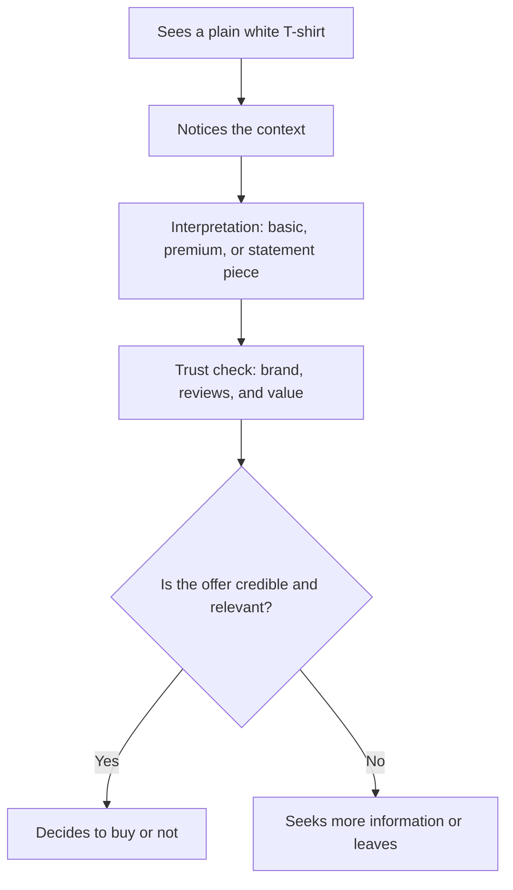

# Chapter 1: Persuasion, Trust, and Decision-Making

Persuasion is not magic. It is the practice of shaping how someone notices information, interprets it, trusts it, and decides what to do next. A person may notice a product, understand what it means, and feel some degree of trust before they ever click buy or agree to an idea. Persuasion works in that space between attention and action.

A plain-language definition is this: persuasion is an attempt to help someone see a reason, feel a connection, or recognize a value that makes a choice more likely. It is not necessarily about forcing a decision. It is about helping a person understand why a choice might be sensible, valuable, or aligned with who they are.

That definition matters because a designer, marketer, teacher, or organizer is often trying to influence behavior without resorting to threats, pressure, or trickery. Good persuasion usually respects the other person’s ability to think. It tries to make the best option clearer, not to hide the truth.

## Persuasion, Coercion, and Manipulation

Persuasion is different from coercion and manipulation.

- Coercion uses force, threats, or extreme pressure. A person is not truly choosing freely.
- Manipulation uses hidden pressure, misleading framing, or emotional tricks to get compliance without honest consent.
- Persuasion, in its more ethical form, gives information, builds trust, and helps someone weigh reasons.

The difference is not always perfectly neat, but it is important. A persuasive message can be honest and respectful. A manipulative message may be technically persuasive while also deceptive. If the person is being pushed to act without real understanding, the process is not healthy persuasion.

Think about a plain white T-shirt. The cloth is the same in every case. What changes is the story around it: Is it a basic work shirt? A premium minimalist staple? A statement of authenticity? A “must-have” item because the brand is scarce? The shirt itself does not change; the meaning does.

## Why Persuasion Matters in Design

Design is often about making decisions easier, clearer, and more informed. Designers shape hierarchy, contrast, language, sequence, and context. Those choices can help people notice the right things, understand what matters, and trust the message.

Persuasion is therefore not only a sales tool. It is also a communication tool. It can help someone:

- notice a problem worth caring about
- interpret an idea in a useful way
- feel trust in a brand, message, or product
- act on a decision with confidence

This is useful in areas like public health campaigns, educational materials, product design, and brand communication. It matters because decisions are rarely made from pure logic alone. People also weigh emotion, memory, prior experience, social context, and what feels credible.

## Cialdini’s Principles of Influence

Robert Cialdini, a social psychologist, described a set of recurring patterns in how people are influenced. These ideas are useful because they are not random. They reflect common human tendencies.

Here are the major principles, stated simply:

1. Reciprocity: People feel obliged to return favors or kindness.
2. Scarcity: People value things more when they seem limited or difficult to get.
3. Authority: People tend to trust signals of expertise or status.
4. Consistency: People like their choices to line up with what they have said or done before.
5. Social Proof: People look to others to judge what is normal, safe, or desirable.
6. Liking: People are more likely to trust and respond to people or brands they feel positively toward.

These are not “tricks” in themselves. They are patterns of human behavior. The ethical question is how they are used. A product can use social proof honestly, or it can exaggerate popularity. A brand can highlight scarcity honestly, or it can manufacture false urgency.

## A Practical Table: Principle to Use and Risk

| Principle | Mechanism | Ethical use | Misuse risk |
| --- | --- | --- | --- |
| Reciprocity | People feel pressure to repay a favor, gift, or helpful gesture. | Offer useful information, samples, or genuine value. | Overloading people with “free” offers and then expecting compliance. |
| Scarcity | Limited availability raises perceived value. | Clearly explain real limits such as inventory, deadlines, or special production runs. | Creating artificial urgency or hiding essential facts to push fast decisions. |
| Authority | People trust expertise, credentials, or social status. | Show honest expertise, clear experience, and transparent credentials. | Pretending to be an expert or using status symbols without actual knowledge. |
| Consistency | People prefer choices that match prior commitments. | Invite small, voluntary commitments that lead toward a clear action. | Pressuring people into repeated decisions that they do not truly want. |
| Social Proof | People rely on others to decide what is accepted or wise. | Share real customer experiences, evidence, and community norms. | Using fake reviews, manipulated testimonials, or misleading popularity signals. |
| Liking | People respond more to people and brands they feel close to or positively about. | Build authentic relationships through clear communication and shared values. | Exploiting personal warmth, flattery, or emotional connection without honesty. |

The table shows why persuasion is not the same as pressure. The same principle can be used with respect or with manipulation. The difference often lies in clarity, transparency, and genuine choice.

## Beyond Cialdini: Other Useful Ideas

Cialdini gives a strong foundation, but persuasion also draws from other fields.

### 1. Framing and Loss Aversion

People often react more strongly to the possibility of loss than to the possibility of gain. This is called loss aversion. A message can be more persuasive if it makes the cost of inaction clear without exaggeration.

Example: “This shirt is a durable basic you will wear for years” is one message. “This shirt will likely be replaced by a lower-quality alternative if you keep buying fast fashion” is another. The first focuses on value; the second uses loss as a motivator. Both can be framed ethically if the claim is fair and relevant.

### 2. Cognitive Load and Clarity

People make better decisions when information is easy to process. Cognitive load refers to the mental effort required to understand something. A message with too many competing claims is harder to trust.

A designer usually persuades better by reducing unnecessary friction: a clear headline, fewer distractions, more obvious labels, and a straightforward reason to care.

Example: A T-shirt listing “premium cotton, relaxed fit, ethically produced, limited run, designed for everyday movement” may be memorable if the message is ordered clearly. If five different claims compete for attention, the message loses force.

### 3. Rhetoric: Ethos, Pathos, and Logos

Ancient rhetoric still matters. Aristotle’s ideas are often phrased as ethos, pathos, and logos:

- Ethos: credibility and trust
- Pathos: emotion and connection
- Logos: logic and evidence

A strong message often needs more than one of these. A shirt may be persuasive because it looks well made (logos), because it fits a lifestyle (pathos), and because the brand seems trustworthy and competent (ethos).

The ethical challenge is to match the message to the truth. Emotion is not automatically manipulative; it is part of how humans decide. But emotion becomes a problem when it hides facts or tries to bypass judgment.

## A White T-Shirt Example

A plain white T-shirt is a useful example because it is a simple object that can be framed in many ways.

### Version 1: The Essential Everyday Shirt

This version emphasizes practicality. The shirt is described as clean, versatile, comfortable, and easy to wear. The message is: “You want a reliable everyday staple.”

This is a form of persuasion rooted in usefulness and simplicity. It does not pretend the shirt is a luxury item. It appeals to function and everyday life.

### Version 2: The Minimalist Luxury Item

This version frames the same shirt as a premium product. The copy emphasizes fabric quality, construction, and restraint. The message is: “This is an expression of taste.”

The shirt itself did not change. The framing shifted from utility to identity. It invites the buyer to see the product as an indicator of sophistication or discernment.

### Version 3: The Statement Piece

A brand might frame the shirt as part of a creative, rebellious, or socially engaged identity. The shirt is sold as a marker of culture, self-expression, or values.

The ethical question here is whether the brand is honestly representing the shirt’s role in identity, or if it is using culture as a shortcut to signal status.

### Version 4: A Scarcity Story

A retailer may say the shirt is “limited edition,” “made in a small run,” or “available for this week only.” The physical product has not changed, but the context has. The brand uses urgency and exclusivity to raise perceived value.

This is not always dishonest, but it becomes risky when scarcity is exaggerated or when the buyer is pushed into a fast decision before they have time to consider alternatives.

The key lesson: a product is more than its object. It is also a set of meanings, assumptions, and emotional cues. Persuasion shapes that surrounding story.

## Decision Journey: A Simple Example

This simple journey shows how persuasion works as a process. The buyer does not decide only from the object. They decide based on attention, interpretation, trust, and context.

## Questions to Ask Before Trying to Persuade

Before trying to persuade someone, a designer or communicator should ask:

- What exactly am I trying to change: attention, interpretation, trust, or action?
- Am I offering clear information or hiding important facts?
- Am I appealing to real value, or am I creating false urgency or pressure?
- What assumptions am I making about the audience?
- Is there a respectful way to let the person decide for themselves?
- Am I trying to help them understand, or am I trying to bypass their judgment?
- If my message were fully transparent, would it still hold up?

Good persuasion is not about making a person feel trapped. It is about making a useful, honest path easier to see.

## Ethical Cautions

Persuasion becomes harmful when it focuses on control rather than understanding. A few warning signs include:

- exaggerated claims that no reasonable person could verify
- pressure tactics that leave no space for reflection
- hidden information that changes the meaning of the choice
- using fear, shame, or insecurity to force compliance
- exploiting vulnerability without care or responsibility

Ethical persuasion respects the audience’s ability to decide. It gives them enough information to make a thoughtful choice. It does not confuse pressure with persuasion.

## Explore Further

If you want to go beyond this chapter, useful search suggestions include:

- Cialdini principles of influence explained for beginners
- framing effects in marketing and decision-making
- loss aversion examples in everyday life
- rhetoric ethos pathos logos explained simply
- cognitive load and design for clarity
- persuasion vs manipulation in communication ethics

These searches are helpful because they connect the basic theory to practical design and everyday decisions.

## What You Should Remember

Persuasion is the art of helping people notice, understand, trust, and act. It is strongest when it is respectful, honest, and clear. It is different from coercion and manipulation because it does not assume that the other person’s judgment can simply be bypassed.

Cialdini’s principles are useful guides, but they are not a license to pressure people. Framing, loss aversion, and rhetoric show that communication works through attention and meaning as much as through facts. The same plain white T-shirt can be sold as a daily essential, a luxury object, or a statement of identity because the meaning is shaped by context.

The goal is not just to get a reaction. The goal is to help someone make a decision that is informed, relevant, and genuinely theirs.
