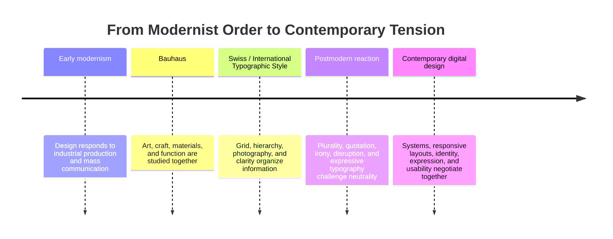
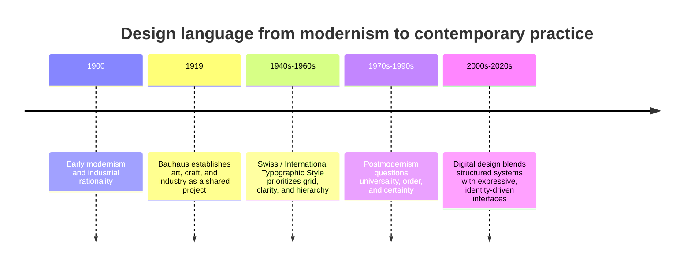

# Chapter 3: Design Language and the Ideas Behind What We See

Visual design does more than make information attractive. It tells us how to read, what to notice, and what kind of world a product belongs to. A sparse layout can suggest discipline. A crowded collage can suggest energy or disagreement. A familiar typeface can feel official, while an unexpected one can feel personal or rebellious.

A **design language** is a recurring system of visual choices: typography, spacing, color, image treatment, layout, materials, and interaction. Like a spoken language, it carries ideas through patterns. It can communicate order, authority, play, efficiency, identity, or doubt before anyone reads the words.

This chapter follows an important story in modern visual design. Modernism often searched for clarity, function, and shared visual systems. Postmodern design challenged the idea that one neutral system could speak for everyone. Contemporary digital design continues to move between these positions.

## A Short Historical Path into Modernism

Modern design developed alongside industrial production, mass communication, new technologies, and changing social conditions. Designers increasingly had to communicate across large audiences through posters, books, products, exhibitions, and public systems. This created pressure for designs that could be reproduced, understood quickly, and organized consistently.

Modernism was not one look or one school. It was a broad set of efforts to make design fit a changing world. Many modernist designers valued function, structure, reduction, and the belief that visual decisions could be reasoned about rather than chosen only for decoration.

Two especially important stages in this story are the Bauhaus and the Swiss or International Typographic Style.

## Bauhaus

The Bauhaus was a school and design movement that connected art, craft, architecture, and industrial production. Its teaching encouraged students to study materials, form, color, construction, and the relationship between making and everyday life.

For a first-year student, the key lesson is not a list of famous names or objects. It is the idea that design could be taught as a process of investigation. A chair, a building, a page, or a poster could be examined through its materials, structure, use, and relationship to modern life.

Bauhaus-influenced thinking helped make design feel purposeful rather than merely ornamental. It also encouraged experimentation. Simple geometry, functional construction, asymmetry, and careful relationships between text and image became tools for solving communication problems.

## Swiss / International Typographic Style

The Swiss or International Typographic Style developed a particularly disciplined approach to visual communication. Designers associated with this tradition often used grids, sans serif typography, asymmetrical layouts, photography, and clear hierarchy. The page was organized so that the reader could move through it efficiently.

Its principles can be summarized as:

- **Grid:** A hidden structure aligns elements and creates relationships.
- **Hierarchy:** Size, weight, position, and spacing show what matters first.
- **Clarity:** Information is arranged so the intended message is easier to understand.
- **Reduction:** Unnecessary decoration is removed so essential relationships become visible.
- **Function:** Visual choices serve communication, use, and navigation rather than existing only as surface style.

These principles are still visible in editorial layouts, transit systems, software interfaces, dashboards, and product websites. A grid can make a complicated set of choices feel manageable. Hierarchy can help a user find the next action. Reduction can keep a screen from competing with itself.

Modernist clarity is useful, but it is not automatically neutral. Every grid includes some choices about what belongs, what is prioritized, and what is left out. A system that feels universal to one audience may feel distant or restrictive to another.

## The Postmodern Reaction

Postmodern design developed partly as a reaction against modernist certainty, restraint, universality, and order. Instead of assuming that one clean system could represent everyone, postmodern approaches made room for plurality, contradiction, local identity, popular culture, historical quotation, and personal expression.

Common postmodern strategies include:

- **Plurality:** Multiple styles, voices, and cultural references can coexist.
- **Irony:** A design may knowingly play with conventions instead of presenting itself as completely sincere.
- **Disruption:** Alignment, sequence, and expected reading order may be interrupted.
- **Quotation:** Earlier styles, commercial forms, or familiar visual codes may be borrowed and reframed.
- **Expressive typography:** Type can act as image, voice, texture, or attitude rather than only as a transparent carrier of words.

Postmodernism is not simply the opposite of modernism, and it is not a synonym for messy design. A disrupted layout can be carefully constructed. An ironic reference can still communicate clearly. The important change is that the design makes its cultural position more visible and treats neutrality as something to question.

## The Tensions That Continue

The history is most useful when it becomes a set of questions rather than a museum timeline that ends. Contemporary design still moves between competing goals:

| Modernist tendency | Postmodern response | Contemporary question |
| --- | --- | --- |
| Order | Disruption | Should the interface guide a predictable path or invite exploration? |
| Universality | Identity and plurality | Who is represented by the default system, and who is missing? |
| Clarity | Expression | Should the message disappear behind usability, or should the voice be memorable? |
| Grid | Anti-grid | Does alignment reduce confusion, or would a broken structure better express the content? |
| Restraint | Abundance | Does removing elements focus attention, or erase useful texture and context? |
| Function | Irony | Should the design state its purpose directly, or question the conventions around that purpose? |

These tensions appear in current websites and products. A banking dashboard may use a strict grid and strong hierarchy because errors are costly. A music or fashion site may use motion, oversized type, unusual cropping, and layered references to express a scene or mood. A design system may establish shared components for consistency while allowing different communities to change language, imagery, and emphasis.

The best choice depends on the situation. A playful anti-grid can make a campaign memorable, but it may make a checkout process frustrating. A restrained interface can make a tool dependable, but it may also feel generic if it gives no sense of whose needs shaped it.

## Contemporary Digital Examples

### Product interfaces

Many digital products use modernist principles in their navigation: consistent spacing, repeated components, clear labels, and a visible hierarchy of actions. These choices reduce the effort needed to learn the interface. A product can still add expressive illustrations, local language, or motion without abandoning structure entirely.

### Editorial and cultural websites

A cultural publication may use an established grid for articles while breaking that grid for an essay about memory, protest, or visual culture. The disruption becomes part of the argument. The reader does not only consume the content; they experience a change in pace and expectation.

### Brand systems

A contemporary brand may define a restrained core system while allowing campaigns to quote historical styles, use humor, or foreground different communities. This combination shows that consistency does not have to mean sameness. A system can provide recognition while leaving room for identity and context.

### Generative and responsive layouts

Digital design can change in response to screen size, user input, time, or data. A responsive layout may preserve hierarchy while changing its arrangement. This creates a practical version of the old tension: the system must remain understandable, but it also has to adapt rather than impose one fixed composition everywhere.

## How to Read a Design

When looking at a poster, website, package, app, or product page, ask:

1. **What do I notice first?** Identify the visual hierarchy created by scale, contrast, position, motion, or color.
2. **What structure is organizing the page?** Look for a grid, repeated modules, symmetry, alignment, or an intentional break from those systems.
3. **How is type behaving?** Is typography quiet and informational, or is it expressive, oversized, layered, distorted, or image-like?
4. **What is included and excluded?** Reduction can focus attention, but omission can also hide context or limit whose perspective appears.
5. **What cultural references are being quoted?** Notice echoes of institutions, advertisements, technology, popular media, craft, or earlier design movements.
6. **What kind of behavior does the design invite?** Does it ask you to scan, compare, purchase, explore, participate, or question?
7. **Who seems to be the imagined audience?** Consider language, imagery, accessibility, assumptions, and whose experience is treated as normal.
8. **Do the visual choices support the function?** A striking design may be memorable, but the important question is whether it helps the audience do what they came to do.

Reading design this way turns taste into analysis. You can like or dislike a visual choice and still explain what that choice is doing.

## The Same White T-Shirt, Two Design Languages

Return to the exact same high-quality plain white T-shirt. The physical product stays the same, but the presentation can make it feel like a different product.

### Modernist presentation

A modernist presentation might show the shirt frontally against a plain background. A precise grid aligns the product photograph, measurements, fabric information, and price. Typography is restrained, spacing is generous, and the copy emphasizes fit, construction, and everyday function.

The shirt feels dependable, rational, and carefully considered. The customer is invited to buy clarity and confidence: a useful object without unnecessary noise.

### Postmodern presentation

A postmodern presentation might crop the shirt unexpectedly, combine product photography with scanned textures, interrupt the grid, and use contrasting type sizes. The copy might acknowledge the familiar status of the white T-shirt while playing with the conventions of fashion advertising. References to workwear, street imagery, or older catalog styles could be quoted and recombined.

The shirt feels culturally aware, expressive, and open to reinterpretation. The customer is invited to buy a position toward fashion: the freedom to wear a basic while refusing a single correct way to understand it.

Neither presentation is automatically better. The modernist version may help a careful buyer compare details. The postmodern version may make the object feel more distinctive and invite participation. Each attaches a different kind of meaning to the same shirt.

## A Timeline of Design Language

This timeline is a simplified map, not a claim that one movement cleanly replaced another. Modernist and postmodern strategies continue to coexist, often within the same product.

## Museum Research

To study design history responsibly, look at authentic examples in museum and institutional collections rather than relying only on unsourced image boards or summaries. Collections can provide object records, dates, makers, materials, curatorial context, and high-quality images. The details available will differ by institution, so verify each object yourself.

Useful places to begin searching include:

- The Metropolitan Museum of Art
- The Museum of Modern Art (MoMA)
- Cooper Hewitt, Smithsonian Design Museum
- Victoria and Albert Museum (V&A)
- Bauhaus archives or other university and institutional Bauhaus collections
- National libraries, design museums, and publicly maintained university collections

Suggested search terms:

- `Bauhaus typography poster collection`
- `Bauhaus preliminary course design archive`
- `Swiss International Typographic Style poster collection`
- `modernist grid graphic design museum`
- `postmodern graphic design typography collection`
- `design history exhibition catalog modernism postmodernism`

When you find a promising result, verify the institution, object title, maker, date, and medium on the collection record. Do not assume that an image reposted online is correctly labeled. Record what the institution actually says, and distinguish your own visual interpretation from the collection's documented facts.

## What You Should Remember

Design language communicates ideas through repeated visual choices. Modernist traditions such as Bauhaus and the Swiss / International Typographic Style emphasize structure, function, hierarchy, reduction, and clarity. Postmodern approaches question universal certainty through plurality, irony, quotation, disruption, and expressive typography.

These are not sealed historical boxes. Contemporary digital design continues to negotiate order and disruption, universality and identity, clarity and expression, grid and anti-grid, restraint and abundance, and function and irony.

The same plain white T-shirt can feel precise and dependable in a modernist presentation or expressive and culturally charged in a postmodern one. To read a design well, look beyond whether it appears attractive. Ask what it makes easy to notice, what identity it imagines, and what ideas its visual language makes believable.
# Chapter 3: Design Language and the Meaning of Visual Style

Design is not just decoration. It is a system for organizing attention, signaling values, and shaping how people interpret an object or experience. A design language is the set of visual choices that a brand, publication, or product uses to communicate what it is and what it stands for.

This chapter follows a historical path from early modernism to postmodernism and then back into contemporary digital design. The point is not to treat history as a neat sequence of finished styles. It is to show how visual traditions create expectations and how designers continue to negotiate tensions such as order versus disruption, clarity versus expression, and function versus irony.

## A Short Path into Modernism

Modernism emerged in the late nineteenth and early twentieth centuries as a response to industrialization, urban growth, and the desire for clear, rational, and functional systems. Designers and artists were interested in simplifying form, making visual communication more legible, and finding new ways to structure information.

This era did not begin with one single rulebook. It was shaped by many influences, including industrial production, scientific thinking, and a wider belief that design could improve everyday life. The modernist impulse often favored efficiency, honesty of materials, and a strong visual order.

The early modern period helped create the conditions for some of the most important design movements of the twentieth century.

## Bauhaus

The Bauhaus, founded in Germany in 1919, is one of the most influential design schools in modern history. It brought together art, craft, and industry in a way that emphasized the relationship between form and function. The school taught that design should serve everyday human needs while still being intellectually serious and visually coherent.

Bauhaus designers often reduced forms to their essential parts. They looked for clear structure, disciplined composition, and a careful relationship between material and purpose. Type, objects, furniture, and architecture were treated as parts of a broader system of modern living.

A key lesson from the Bauhaus is that design is not only aesthetic. It is also practical and social. It aims to improve how people live and use objects.

## Swiss / International Typographic Style

A later development, especially in postwar Switzerland and Europe, came to be known as the Swiss or International Typographic Style. This approach favored clarity, objectivity, and systematic structure. Designers used grids, sans-serif type, asymmetrical layouts, and strong hierarchy to organize information with precision.

This style became especially important in posters, corporate identity systems, and editorial design. It treated communication as a problem of logic: if the information is clear and the structure is disciplined, the design works.

The Swiss style helped shape the modern idea that design could be universal, rational, and highly legible. It influenced not just print design but also digital design systems later on.

## Modernist Principles

Modernist design is often associated with several core principles:

- Grid: a structured system for organizing space
- Hierarchy: a way of guiding the eye to the most important information first
- Clarity: design should communicate without confusion
- Reduction: remove unnecessary decoration to reveal the essential message
- Function: form should serve a purpose, not just aesthetic flourish

These principles created a strong visual language of control and legibility. They were especially powerful in branding, publishing, and information design because they helped large amounts of content feel orderly and trustworthy.

But modernism also had limits. A highly disciplined system can sometimes feel overly universal, too rigid, or detached from emotional and cultural complexity. This is part of the reason later design movements reacted against it.

## Postmodernism as a Reaction

Postmodern design emerged partly as a reaction against modernist certainty. If modernism prized order, universality, and clean reduction, postmodernism often valued plurality, contradiction, surprise, and identity.

Postmodern design does not reject all modernist ideas. Instead, it questions the idea that one style can speak for everyone. It often celebrates:

- plurality: multiple meanings and viewpoints
- irony: distance or playful contradiction
- disruption: breaking visual order on purpose
- quotation: referencing older styles and cultural signs
- expressive typography: using type as a voice rather than just a container for words

This kind of design can feel less static and more unstable. It may use collage, layered imagery, unusual grid breaks, or deliberately conflicting visual cues. In other words, it often asks: what if communication is not purely objective, but also emotional, cultural, and self-aware?

## The Ongoing Tension in Design

The important point is that design does not move in a straight line from modernism to postmodernism and then stop. The tension continues in the present.

Modernist ideas still shape contemporary digital design. Many interfaces rely on grids, hierarchy, clarity, and function. At the same time, postmodern approaches remain important in product design, branding, and editorial work, especially where identity, irony, or cultural specificity matter.

The design field continues to negotiate:

- order and disruption
- universality and identity
- clarity and expression
- grid and anti-grid
- restraint and abundance
- function and irony

A modern dashboard may still use a clear grid and disciplined hierarchy, while a creative brand site may deliberately break those patterns to feel more personal or rebellious. Many contemporary projects do both: they use a structured system and then disrupt it intentionally.

## Contemporary Digital Design Examples

This tension appears across digital products and websites.

### Example 1: Corporate Product Design

A productivity app may use a strong grid, neutral palette, and careful hierarchy so the interface feels trustworthy and efficient. The design is modernist in spirit: reduce noise, guide action, support function.

### Example 2: Creative Portfolio or Brand Site

A design studio or artist may use dramatic typography, asymmetry, oversized text, collage, and layered textures. The design may not be as “clear” in a strict modernist sense, but it communicates identity, attitude, and originality. This is closer to a postmodern approach.

### Example 3: E-commerce and Brand Systems

Many modern storefronts combine the two. A brand may use a clear product grid and strong search system, but also add playful editorial layouts, bold type, or a deliberately off-balance composition to create personality. This is not a contradiction; it is the ongoing negotiation between system and expression.

The lesson is that contemporary design often does not choose one side completely. It mixes traditions and purposefully balances clarity with atmosphere.

## Comparison Table

| Design tradition | Main visual traits | Core value | Typical risk or limitation |
| --- | --- | --- | --- |
| Early Modernism | Rational structure, industrial production, functional form | Efficiency and clarity | Can feel rigid, impersonal, or overly universal |
| Bauhaus | Integration of art and industry, reduction, system thinking | Useful beauty and social function | Can seem austere or doctrinaire |
| Swiss / International Typographic Style | Grid, sans-serif type, strong hierarchy, objectivity | Legibility and order | Can feel cold or over-standardized |
| Postmodernism | Quotation, collage, disruption, expressive typography | Identity, plurality, irony | Can feel chaotic or self-conscious |
| Contemporary digital design | Mixed systems, responsive layouts, hybrid aesthetics | Flexibility and audience fit | Can become visually noisy if strategy is weak |

This table helps show that design history is not simply a march from “good” to “bad” styles. Each tradition offers a different answer to the question of how visual communication should work.

## A Mermaid Timeline

This timeline is simplified, but it highlights a useful story: design styles do not appear in isolation. They respond to technological change, culture, and the needs of communication.

## How to Read a Design

When you look at a design, ask a few questions instead of only reacting to whether it looks “good” or “bad.”

- What is the hierarchy? What does the eye see first?
- What is the grid or underlying structure? Does it feel controlled or loose?
- What does the typography communicate: authority, friendliness, rebellion, seriousness, or play?
- What is the relationship between text and image?
- Does the design feel ordered, chaotic, restrained, or expressive?
- What cultural or historical references does it borrow?
- What audience is this design trying to speak to?

A good design does not simply “look nice.” It organizes a message in a way that fits purpose, audience, and context. Design language communicates values before a reader fully understands the content.

## Museum Research

If you want to study design in a real context, look for authentic examples in museum and institutional collections. These collections often show the historical lineage of modernist and postmodern design more reliably than random online examples.

Useful places to search include:

- The Metropolitan Museum of Art
- Museum of Modern Art (MoMA)
- Cooper Hewitt, Smithsonian Design Museum
- Victoria and Albert Museum (V&A)
- Bauhaus archives and related institutional collections
- university art and design archives
- design museum collections in your own city or region

Search terms you can use:

- Bauhaus poster design
- Swiss graphic design poster
- International Typographic Style layout
- modernist typography exhibition
- postmodern graphic design 1970s 1980s
- design museum collection modernism
- twentieth-century design archives

Do not treat a museum search result as proof of a claim until you inspect the object, date, and institutional context. The goal is to look closely, compare historical examples, and build your own understanding rather than rely on summaries alone.

## Returning to the White T-shirt

The same plain white T-shirt can look like a different product depending on the design language around it.

A modernist presentation might use a neutral palette, strict alignment, a clean sans-serif type system, clear product details, and a simple grid. The shirt feels like a durable, functional, honest staple. It is not trying to be theatrical. It is trying to communicate reliability and purposeful simplicity.

A postmodern presentation might use expressive typography, unexpected layout, collage-like imagery, asymmetry, or a highly stylized campaign that values personality and disruption over neatness. The same shirt might feel like a cultural object, a statement of identity, or a rebellious mode of dressing rather than a basic garment.

The clothing is the same. The design language changes the meaning.

## What You Should Remember

Visual design is a language that communicates meaning before a person even reads the words. In modernism, designers often emphasized clarity, order, reduction, and function. In postmodernism, designers questioned those assumptions and embraced plurality, irony, quotation, and expressive disruption.

The central lesson is that design is not just about appearance. It is about how a system of visual choices frames attention, trust, identity, and use. Contemporary digital design still carries this tension: it often combines the discipline of grids and hierarchy with the expressive freedom of identity-driven visual language.

The best design work does not pretend one tradition is “the only right answer.” It understands the history, chooses the right tools for the message, and makes the visual language serve the audience honestly.
