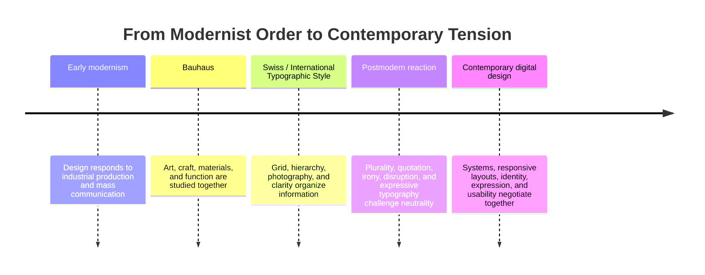

# Chapter 3: Design Language and the Ideas Behind What We See

Visual design does more than make information attractive. It tells us how to read, what to notice, and what kind of world a product belongs to. A sparse layout can suggest discipline. A crowded collage can suggest energy or disagreement. A familiar typeface can feel official, while an unexpected one can feel personal or rebellious.

A **design language** is a recurring system of visual choices: typography, spacing, color, image treatment, layout, materials, and interaction. Like a spoken language, it carries ideas through patterns. It can communicate order, authority, play, efficiency, identity, or doubt before anyone reads the words.

This chapter follows an important story in modern visual design. Modernism often searched for clarity, function, and shared visual systems. Postmodern design challenged the idea that one neutral system could speak for everyone. Contemporary digital design continues to move between these positions.

## A Short Historical Path into Modernism

Modern design developed alongside industrial production, mass communication, new technologies, and changing social conditions. Designers increasingly had to communicate across large audiences through posters, books, products, exhibitions, and public systems. This created pressure for designs that could be reproduced, understood quickly, and organized consistently.

Modernism was not one look or one school. It was a broad set of efforts to make design fit a changing world. Many modernist designers valued function, structure, reduction, and the belief that visual decisions could be reasoned about rather than chosen only for decoration.

Two especially important stages in this story are the Bauhaus and the Swiss or International Typographic Style.

## Bauhaus

The Bauhaus was a school and design movement that connected art, craft, architecture, and industrial production. Its teaching encouraged students to study materials, form, color, construction, and the relationship between making and everyday life.

For a first-year student, the key lesson is not a list of famous names or objects. It is the idea that design could be taught as a process of investigation. A chair, a building, a page, or a poster could be examined through its materials, structure, use, and relationship to modern life.

Bauhaus-influenced thinking helped make design feel purposeful rather than merely ornamental. It also encouraged experimentation. Simple geometry, functional construction, asymmetry, and careful relationships between text and image became tools for solving communication problems.

## Swiss / International Typographic Style

The Swiss or International Typographic Style developed a particularly disciplined approach to visual communication. Designers associated with this tradition often used grids, sans serif typography, asymmetrical layouts, photography, and clear hierarchy. The page was organized so that the reader could move through it efficiently.

Its principles can be summarized as:

- **Grid:** A hidden structure aligns elements and creates relationships.
- **Hierarchy:** Size, weight, position, and spacing show what matters first.
- **Clarity:** Information is arranged so the intended message is easier to understand.
- **Reduction:** Unnecessary decoration is removed so essential relationships become visible.
- **Function:** Visual choices serve communication, use, and navigation rather than existing only as surface style.

These principles are still visible in editorial layouts, transit systems, software interfaces, dashboards, and product websites. A grid can make a complicated set of choices feel manageable. Hierarchy can help a user find the next action. Reduction can keep a screen from competing with itself.

Modernist clarity is useful, but it is not automatically neutral. Every grid includes some choices about what belongs, what is prioritized, and what is left out. A system that feels universal to one audience may feel distant or restrictive to another.

## The Postmodern Reaction

Postmodern design developed partly as a reaction against modernist certainty, restraint, universality, and order. Instead of assuming that one clean system could represent everyone, postmodern approaches made room for plurality, contradiction, local identity, popular culture, historical quotation, and personal expression.

Common postmodern strategies include:

- **Plurality:** Multiple styles, voices, and cultural references can coexist.
- **Irony:** A design may knowingly play with conventions instead of presenting itself as completely sincere.
- **Disruption:** Alignment, sequence, and expected reading order may be interrupted.
- **Quotation:** Earlier styles, commercial forms, or familiar visual codes may be borrowed and reframed.
- **Expressive typography:** Type can act as image, voice, texture, or attitude rather than only as a transparent carrier of words.

Postmodernism is not simply the opposite of modernism, and it is not a synonym for messy design. A disrupted layout can be carefully constructed. An ironic reference can still communicate clearly. The important change is that the design makes its cultural position more visible and treats neutrality as something to question.

## The Tensions That Continue

The history is most useful when it becomes a set of questions rather than a museum timeline that ends. Contemporary design still moves between competing goals:

| Modernist tendency | Postmodern response | Contemporary question |
| --- | --- | --- |
| Order | Disruption | Should the interface guide a predictable path or invite exploration? |
| Universality | Identity and plurality | Who is represented by the default system, and who is missing? |
| Clarity | Expression | Should the message disappear behind usability, or should the voice be memorable? |
| Grid | Anti-grid | Does alignment reduce confusion, or would a broken structure better express the content? |
| Restraint | Abundance | Does removing elements focus attention, or erase useful texture and context? |
| Function | Irony | Should the design state its purpose directly, or question the conventions around that purpose? |

These tensions appear in current websites and products. A banking dashboard may use a strict grid and strong hierarchy because errors are costly. A music or fashion site may use motion, oversized type, unusual cropping, and layered references to express a scene or mood. A design system may establish shared components for consistency while allowing different communities to change language, imagery, and emphasis.

The best choice depends on the situation. A playful anti-grid can make a campaign memorable, but it may make a checkout process frustrating. A restrained interface can make a tool dependable, but it may also feel generic if it gives no sense of whose needs shaped it.

## Contemporary Digital Examples

### Product interfaces

Many digital products use modernist principles in their navigation: consistent spacing, repeated components, clear labels, and a visible hierarchy of actions. These choices reduce the effort needed to learn the interface. A product can still add expressive illustrations, local language, or motion without abandoning structure entirely.

### Editorial and cultural websites

A cultural publication may use an established grid for articles while breaking that grid for an essay about memory, protest, or visual culture. The disruption becomes part of the argument. The reader does not only consume the content; they experience a change in pace and expectation.

### Brand systems

A contemporary brand may define a restrained core system while allowing campaigns to quote historical styles, use humor, or foreground different communities. This combination shows that consistency does not have to mean sameness. A system can provide recognition while leaving room for identity and context.

### Generative and responsive layouts

Digital design can change in response to screen size, user input, time, or data. A responsive layout may preserve hierarchy while changing its arrangement. This creates a practical version of the old tension: the system must remain understandable, but it also has to adapt rather than impose one fixed composition everywhere.

## How to Read a Design

When looking at a poster, website, package, app, or product page, ask:

1. **What do I notice first?** Identify the visual hierarchy created by scale, contrast, position, motion, or color.
2. **What structure is organizing the page?** Look for a grid, repeated modules, symmetry, alignment, or an intentional break from those systems.
3. **How is type behaving?** Is typography quiet and informational, or is it expressive, oversized, layered, distorted, or image-like?
4. **What is included and excluded?** Reduction can focus attention, but omission can also hide context or limit whose perspective appears.
5. **What cultural references are being quoted?** Notice echoes of institutions, advertisements, technology, popular media, craft, or earlier design movements.
6. **What kind of behavior does the design invite?** Does it ask you to scan, compare, purchase, explore, participate, or question?
7. **Who seems to be the imagined audience?** Consider language, imagery, accessibility, assumptions, and whose experience is treated as normal.
8. **Do the visual choices support the function?** A striking design may be memorable, but the important question is whether it helps the audience do what they came to do.

Reading design this way turns taste into analysis. You can like or dislike a visual choice and still explain what that choice is doing.

## The Same White T-Shirt, Two Design Languages

Return to the exact same high-quality plain white T-shirt. The physical product stays the same, but the presentation can make it feel like a different product.

### Modernist presentation

A modernist presentation might show the shirt frontally against a plain background. A precise grid aligns the product photograph, measurements, fabric information, and price. Typography is restrained, spacing is generous, and the copy emphasizes fit, construction, and everyday function.

The shirt feels dependable, rational, and carefully considered. The customer is invited to buy clarity and confidence: a useful object without unnecessary noise.

### Postmodern presentation

A postmodern presentation might crop the shirt unexpectedly, combine product photography with scanned textures, interrupt the grid, and use contrasting type sizes. The copy might acknowledge the familiar status of the white T-shirt while playing with the conventions of fashion advertising. References to workwear, street imagery, or older catalog styles could be quoted and recombined.

The shirt feels culturally aware, expressive, and open to reinterpretation. The customer is invited to buy a position toward fashion: the freedom to wear a basic while refusing a single correct way to understand it.

Neither presentation is automatically better. The modernist version may help a careful buyer compare details. The postmodern version may make the object feel more distinctive and invite participation. Each attaches a different kind of meaning to the same shirt.

## A Timeline of Design Language

This timeline is a simplified map, not a claim that one movement cleanly replaced another. Modernist and postmodern strategies continue to coexist, often within the same product.

## Museum Research

To study design history responsibly, look at authentic examples in museum and institutional collections rather than relying only on unsourced image boards or summaries. Collections can provide object records, dates, makers, materials, curatorial context, and high-quality images. The details available will differ by institution, so verify each object yourself.

Useful places to begin searching include:

- The Metropolitan Museum of Art
- The Museum of Modern Art (MoMA)
- Cooper Hewitt, Smithsonian Design Museum
- Victoria and Albert Museum (V&A)
- Bauhaus archives or other university and institutional Bauhaus collections
- National libraries, design museums, and publicly maintained university collections

Suggested search terms:

- `Bauhaus typography poster collection`
- `Bauhaus preliminary course design archive`
- `Swiss International Typographic Style poster collection`
- `modernist grid graphic design museum`
- `postmodern graphic design typography collection`
- `design history exhibition catalog modernism postmodernism`

When you find a promising result, verify the institution, object title, maker, date, and medium on the collection record. Do not assume that an image reposted online is correctly labeled. Record what the institution actually says, and distinguish your own visual interpretation from the collection's documented facts.

## What You Should Remember

Design language communicates ideas through repeated visual choices. Modernist traditions such as Bauhaus and the Swiss / International Typographic Style emphasize structure, function, hierarchy, reduction, and clarity. Postmodern approaches question universal certainty through plurality, irony, quotation, disruption, and expressive typography.

These are not sealed historical boxes. Contemporary digital design continues to negotiate order and disruption, universality and identity, clarity and expression, grid and anti-grid, restraint and abundance, and function and irony.

The same plain white T-shirt can feel precise and dependable in a modernist presentation or expressive and culturally charged in a postmodern one. To read a design well, look beyond whether it appears attractive. Ask what it makes easy to notice, what identity it imagines, and what ideas its visual language makes believable.
