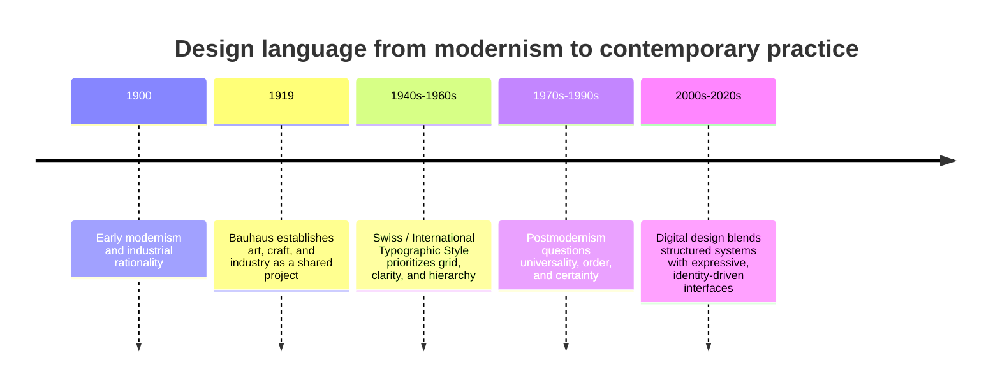

# Chapter 3: Design Language and the Meaning of Visual Style

Design is not just decoration. It is a system for organizing attention, signaling values, and shaping how people interpret an object or experience. A design language is the set of visual choices that a brand, publication, or product uses to communicate what it is and what it stands for.

This chapter follows a historical path from early modernism to postmodernism and then back into contemporary digital design. The point is not to treat history as a neat sequence of finished styles. It is to show how visual traditions create expectations and how designers continue to negotiate tensions such as order versus disruption, clarity versus expression, and function versus irony.

## A Short Path into Modernism

Modernism emerged in the late nineteenth and early twentieth centuries as a response to industrialization, urban growth, and the desire for clear, rational, and functional systems. Designers and artists were interested in simplifying form, making visual communication more legible, and finding new ways to structure information.

This era did not begin with one single rulebook. It was shaped by many influences, including industrial production, scientific thinking, and a wider belief that design could improve everyday life. The modernist impulse often favored efficiency, honesty of materials, and a strong visual order.

The early modern period helped create the conditions for some of the most important design movements of the twentieth century.

## Bauhaus

The Bauhaus, founded in Germany in 1919, is one of the most influential design schools in modern history. It brought together art, craft, and industry in a way that emphasized the relationship between form and function. The school taught that design should serve everyday human needs while still being intellectually serious and visually coherent.

Bauhaus designers often reduced forms to their essential parts. They looked for clear structure, disciplined composition, and a careful relationship between material and purpose. Type, objects, furniture, and architecture were treated as parts of a broader system of modern living.

A key lesson from the Bauhaus is that design is not only aesthetic. It is also practical and social. It aims to improve how people live and use objects.

## Swiss / International Typographic Style

A later development, especially in postwar Switzerland and Europe, came to be known as the Swiss or International Typographic Style. This approach favored clarity, objectivity, and systematic structure. Designers used grids, sans-serif type, asymmetrical layouts, and strong hierarchy to organize information with precision.

This style became especially important in posters, corporate identity systems, and editorial design. It treated communication as a problem of logic: if the information is clear and the structure is disciplined, the design works.

The Swiss style helped shape the modern idea that design could be universal, rational, and highly legible. It influenced not just print design but also digital design systems later on.

## Modernist Principles

Modernist design is often associated with several core principles:

- Grid: a structured system for organizing space
- Hierarchy: a way of guiding the eye to the most important information first
- Clarity: design should communicate without confusion
- Reduction: remove unnecessary decoration to reveal the essential message
- Function: form should serve a purpose, not just aesthetic flourish

These principles created a strong visual language of control and legibility. They were especially powerful in branding, publishing, and information design because they helped large amounts of content feel orderly and trustworthy.

But modernism also had limits. A highly disciplined system can sometimes feel overly universal, too rigid, or detached from emotional and cultural complexity. This is part of the reason later design movements reacted against it.

## Postmodernism as a Reaction

Postmodern design emerged partly as a reaction against modernist certainty. If modernism prized order, universality, and clean reduction, postmodernism often valued plurality, contradiction, surprise, and identity.

Postmodern design does not reject all modernist ideas. Instead, it questions the idea that one style can speak for everyone. It often celebrates:

- plurality: multiple meanings and viewpoints
- irony: distance or playful contradiction
- disruption: breaking visual order on purpose
- quotation: referencing older styles and cultural signs
- expressive typography: using type as a voice rather than just a container for words

This kind of design can feel less static and more unstable. It may use collage, layered imagery, unusual grid breaks, or deliberately conflicting visual cues. In other words, it often asks: what if communication is not purely objective, but also emotional, cultural, and self-aware?

## The Ongoing Tension in Design

The important point is that design does not move in a straight line from modernism to postmodernism and then stop. The tension continues in the present.

Modernist ideas still shape contemporary digital design. Many interfaces rely on grids, hierarchy, clarity, and function. At the same time, postmodern approaches remain important in product design, branding, and editorial work, especially where identity, irony, or cultural specificity matter.

The design field continues to negotiate:

- order and disruption
- universality and identity
- clarity and expression
- grid and anti-grid
- restraint and abundance
- function and irony

A modern dashboard may still use a clear grid and disciplined hierarchy, while a creative brand site may deliberately break those patterns to feel more personal or rebellious. Many contemporary projects do both: they use a structured system and then disrupt it intentionally.

## Contemporary Digital Design Examples

This tension appears across digital products and websites.

### Example 1: Corporate Product Design

A productivity app may use a strong grid, neutral palette, and careful hierarchy so the interface feels trustworthy and efficient. The design is modernist in spirit: reduce noise, guide action, support function.

### Example 2: Creative Portfolio or Brand Site

A design studio or artist may use dramatic typography, asymmetry, oversized text, collage, and layered textures. The design may not be as “clear” in a strict modernist sense, but it communicates identity, attitude, and originality. This is closer to a postmodern approach.

### Example 3: E-commerce and Brand Systems

Many modern storefronts combine the two. A brand may use a clear product grid and strong search system, but also add playful editorial layouts, bold type, or a deliberately off-balance composition to create personality. This is not a contradiction; it is the ongoing negotiation between system and expression.

The lesson is that contemporary design often does not choose one side completely. It mixes traditions and purposefully balances clarity with atmosphere.

## Comparison Table

| Design tradition | Main visual traits | Core value | Typical risk or limitation |
| --- | --- | --- | --- |
| Early Modernism | Rational structure, industrial production, functional form | Efficiency and clarity | Can feel rigid, impersonal, or overly universal |
| Bauhaus | Integration of art and industry, reduction, system thinking | Useful beauty and social function | Can seem austere or doctrinaire |
| Swiss / International Typographic Style | Grid, sans-serif type, strong hierarchy, objectivity | Legibility and order | Can feel cold or over-standardized |
| Postmodernism | Quotation, collage, disruption, expressive typography | Identity, plurality, irony | Can feel chaotic or self-conscious |
| Contemporary digital design | Mixed systems, responsive layouts, hybrid aesthetics | Flexibility and audience fit | Can become visually noisy if strategy is weak |

This table helps show that design history is not simply a march from “good” to “bad” styles. Each tradition offers a different answer to the question of how visual communication should work.

## A Mermaid Timeline

This timeline is simplified, but it highlights a useful story: design styles do not appear in isolation. They respond to technological change, culture, and the needs of communication.

## How to Read a Design

When you look at a design, ask a few questions instead of only reacting to whether it looks “good” or “bad.”

- What is the hierarchy? What does the eye see first?
- What is the grid or underlying structure? Does it feel controlled or loose?
- What does the typography communicate: authority, friendliness, rebellion, seriousness, or play?
- What is the relationship between text and image?
- Does the design feel ordered, chaotic, restrained, or expressive?
- What cultural or historical references does it borrow?
- What audience is this design trying to speak to?

A good design does not simply “look nice.” It organizes a message in a way that fits purpose, audience, and context. Design language communicates values before a reader fully understands the content.

## Museum Research

If you want to study design in a real context, look for authentic examples in museum and institutional collections. These collections often show the historical lineage of modernist and postmodern design more reliably than random online examples.

Useful places to search include:

- The Metropolitan Museum of Art
- Museum of Modern Art (MoMA)
- Cooper Hewitt, Smithsonian Design Museum
- Victoria and Albert Museum (V&A)
- Bauhaus archives and related institutional collections
- university art and design archives
- design museum collections in your own city or region

Search terms you can use:

- Bauhaus poster design
- Swiss graphic design poster
- International Typographic Style layout
- modernist typography exhibition
- postmodern graphic design 1970s 1980s
- design museum collection modernism
- twentieth-century design archives

Do not treat a museum search result as proof of a claim until you inspect the object, date, and institutional context. The goal is to look closely, compare historical examples, and build your own understanding rather than rely on summaries alone.

## Returning to the White T-shirt

The same plain white T-shirt can look like a different product depending on the design language around it.

A modernist presentation might use a neutral palette, strict alignment, a clean sans-serif type system, clear product details, and a simple grid. The shirt feels like a durable, functional, honest staple. It is not trying to be theatrical. It is trying to communicate reliability and purposeful simplicity.

A postmodern presentation might use expressive typography, unexpected layout, collage-like imagery, asymmetry, or a highly stylized campaign that values personality and disruption over neatness. The same shirt might feel like a cultural object, a statement of identity, or a rebellious mode of dressing rather than a basic garment.

The clothing is the same. The design language changes the meaning.

## What You Should Remember

Visual design is a language that communicates meaning before a person even reads the words. In modernism, designers often emphasized clarity, order, reduction, and function. In postmodernism, designers questioned those assumptions and embraced plurality, irony, quotation, and expressive disruption.

The central lesson is that design is not just about appearance. It is about how a system of visual choices frames attention, trust, identity, and use. Contemporary digital design still carries this tension: it often combines the discipline of grids and hierarchy with the expressive freedom of identity-driven visual language.

The best design work does not pretend one tradition is “the only right answer.” It understands the history, chooses the right tools for the message, and makes the visual language serve the audience honestly.
