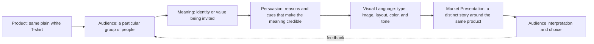

# Chapter 4: The Plain White T-Shirt Case Study

One shirt. Four worlds.

Imagine an ordinary high-quality plain white T-shirt: comfortable fabric, dependable construction, and no special graphic on the front. The physical product stays substantially the same throughout this chapter. What changes is everything around it: the audience, the story, the visual language, and the reasons someone is invited to care.

This is useful because it separates the object from its presentation. A brand does not have to change the shirt to change what the shirt means. It can change the frame through persuasion, archetype, and design.

## The Product We Keep Constant

For all four concepts, assume the shirt has:

- a plain white body with no printed design
- a comfortable everyday fit
- solid construction and ordinary high-quality materials
- a price positioned as considered but not extravagant

Those details are enough to make the shirt credible. They do not, by themselves, tell us whether the shirt belongs in a backpack, a design studio, a family closet, or a protest photograph. The presentation supplies that context.

## Concept One: The Open Road

**Target audience:** People who value travel, independence, and flexible everyday clothing. They may be students, weekend travelers, or anyone who wants a dependable item that can move between places and activities.

**Brand archetype:** Explorer.

**Persuasive principles:** This concept uses liking through an inviting, optimistic voice; consistency by connecting the purchase to an identity of living lightly; and social proof through honest stories of how people use a versatile basic. Logos also matters: the product page should show fit, care, and construction clearly rather than treating adventure as a substitute for information.

**Visual language:** Warm documentary photography, open space, natural light, handwritten route notes, and a small amount of practical annotation. The layout feels mobile and flexible rather than luxurious. Colors come from places encountered along the way, while the white shirt remains the visual anchor.

**Headline:** **Pack less. Go farther.**

**Short product story:** The shirt is the reliable piece that earns space in a small bag. It works on a morning train, under a jacket at night, and on the ordinary day after the exciting one. Its value is not that it turns the wearer into an adventurer; it is that it does not demand much attention while the wearer decides where to go next.

**Likely imagery:** A folded shirt beside a map and a water bottle, a traveler wearing it at a station, close-ups of the collar and seams after repeated wear, and varied landscapes without making the garment disappear into scenery.

**Meaning the customer is invited to buy:** Freedom, adaptability, and the feeling of being ready. The customer is buying a small symbol of an unconstrained life, even though the shirt itself remains an everyday basic.

**Ethical risk or limitation:** Adventure imagery can imply that buying a product creates access to freedom. It can also romanticize constant travel while ignoring cost, privilege, environmental impact, or people who cannot travel easily. The presentation should not claim that the shirt makes someone brave or worldly.

## Concept Two: The Exact Essential

**Target audience:** Design-conscious customers who prefer quiet quality, clear information, and fewer well-chosen possessions.

**Brand archetype:** Sage, with a restrained Ruler influence.

**Persuasive principles:** This version relies on authority through transparent product knowledge, logos through measurements and material details, and consistency by supporting the customer’s commitment to buying less impulsively. Cognitive clarity is part of the persuasion: the page answers practical questions without making the buyer hunt for them.

**Visual language:** A restrained modernist and Swiss-influenced system: a visible grid, asymmetrical alignment, sans serif typography, generous white space, controlled photography, and strong hierarchy. The page may label the shirt with measurements and construction notes. Decoration is reduced so the relationship between product, evidence, and decision stays visible.

**Headline:** **Nothing extra. Everything considered.**

**Short product story:** This is the shirt for someone who wants to know why an object deserves a place in the closet. The story is not about rarity or spectacle. It is about a useful form, clear specifications, and the calm that comes from understanding a purchase before making it.

**Likely imagery:** A precise front and side view, detail photographs of the collar and stitching, a measurement diagram, a care label, and a quiet still life with only the shirt and the information needed to evaluate it.

**Meaning the customer is invited to buy:** Discernment and control. The customer is invited to see restraint as a sign of intelligence and to identify with someone who chooses carefully.

**Ethical risk or limitation:** Minimalism can become a status signal disguised as neutrality. Calling a basic shirt “essential” may encourage overconsumption, and technical language can sound authoritative even when it does not prove meaningful superiority. The brand should make modest claims and show evidence rather than imply that simplicity automatically equals virtue.

## Concept Three: The Basic Is Not Neutral

**Target audience:** Culturally curious customers who enjoy fashion, visual experimentation, irony, and products that comment on their own category.

**Brand archetype:** Rebel, with a Creator influence.

**Persuasive principles:** This concept uses disruption to win attention, liking through a knowing and humorous voice, and consistency by inviting customers who already see themselves as resistant to conventional fashion codes. It may use social proof through community styling, but it should avoid pretending that a niche visual treatment represents everyone.

**Visual language:** Disruptive postmodern composition: cropped photographs, clashing type sizes, collage, visible scans, contradictory captions, and a grid that breaks and re-forms. A product image might sit beside a mock care instruction, a historical-looking catalog fragment, or a deliberately awkward close-up. The shirt remains legible, but the presentation refuses a single polished interpretation.

**Headline:** **A basic with an argument.**

**Short product story:** The white T-shirt is familiar enough to feel invisible. This presentation makes that familiarity strange again. It asks why “basic” is treated as neutral, who gets to define good taste, and whether a plain object can carry an attitude without carrying a logo.

**Likely imagery:** Unexpected crops, a shirt worn in several contrasting subcultures, photocopied textures, overprinted labels, and a product page that lets documentary images collide with glossy fashion conventions.

**Meaning the customer is invited to buy:** Independence from the expected fashion script. The customer is not buying a louder shirt; they are buying the feeling of being alert to, and slightly outside, the system that sells it.

**Ethical risk or limitation:** Rebellion can become a marketable costume. Irony may confuse customers about basic facts such as fit, price, or care, while borrowed cultural references may flatten communities into visual props. Disruption should not hide the offer or claim political depth that the company has not earned.

## Concept Four: Room to Be Human

**Target audience:** People shopping for comfortable, dependable clothing for ordinary life, including families, caregivers, and customers tired of aspirational fashion pressure.

**Brand archetype:** Caregiver, with an Everyperson influence.

**Persuasive principles:** This version uses liking through warmth, reciprocity by offering genuinely useful care information, and social proof through specific customer experiences rather than celebrity endorsement. It also uses framing: the shirt is presented as support for daily life, not as a test of taste or achievement.

**Visual language:** Soft but unsentimental photography, readable type, familiar domestic settings, and a calm palette with enough contrast for accessibility. The layout feels open and practical. It shows different bodies, ages, routines, and ways of wearing the same shirt without turning inclusion into a decorative slogan.

**Headline:** **For the days that make up a life.**

**Short product story:** Some clothing is valuable because it helps the day proceed. This shirt is there for breakfast, work, rest, errands, and the unexpected spill. Its story is deliberately modest: comfort and reliability can be meaningful without becoming a heroic transformation.

**Likely imagery:** A person preparing food, a student studying, someone layering the shirt for work, close-ups of softness and care instructions, and several real-life settings photographed with dignity rather than staged perfection.

**Meaning the customer is invited to buy:** Ease, belonging, and practical care. The customer is invited to feel that ordinary life is worth designing for and that comfort is not a failure of ambition.

**Ethical risk or limitation:** Warmth can become emotional pressure, especially if the brand suggests that buying the shirt is proof that someone cares about others. Inclusive imagery can also become tokenism if the product, sizing, service, or workplace practices do not support the message. The story must remain proportionate to what the shirt and company can actually provide.

## What Changed?

The shirt did not need a new slogan printed on it to become four different market presentations. Each concept changed the relationship between product and audience.

| Concept | Audience and archetype | Main persuasive emphasis | Visual language | Meaning being sold | Main risk |
| --- | --- | --- | --- | --- | --- |
| The Open Road | Travelers and independent people; Explorer | Liking, consistency, honest social proof | Documentary, mobile, place-based | Freedom and readiness | Romanticizing travel or access | 
| The Exact Essential | Design-conscious minimalists; Sage / Ruler | Authority, logos, clarity, consistency | Swiss-influenced grid and reduction | Discernment and control | Turning minimalism into status | 
| The Basic Is Not Neutral | Culturally curious experimenters; Rebel / Creator | Attention through disruption, liking, identity | Postmodern collage and broken grid | Independence from fashion conventions | Selling rebellion as a costume | 
| Room to Be Human | Everyday customers and caregivers; Caregiver / Everyperson | Liking, reciprocity, social proof | Warm documentary realism | Ease, belonging, and care | Emotional pressure or tokenism | 

The table reveals a useful test: if the physical product is held constant, the differences should be traceable to audience, meaning, persuasion, and visual choices. A concept is not radically positioned merely because it changes the color of a button. It is radically positioned when it changes what kind of person the customer is invited to imagine becoming.

## How the Synthesis Works

This diagram is a reminder that the parts work together. An Explorer presentation with a rigid corporate layout may create a mismatch. A Swiss-influenced presentation that hides measurements would weaken its own promise of clarity. A rebellious collage that uses fake scarcity could attract attention while damaging trust. Product, audience, meaning, persuasion, and visual language should reinforce one another, but they should not be allowed to hide what the product actually is.

## A Quick Review Method

When analyzing any product presentation, ask:

1. What physical facts stayed constant?
2. Who is being imagined as the ideal customer?
3. What identity, emotion, or value is the customer invited to buy?
4. Which persuasive principles are visible?
5. What does the visual language make easier to notice or feel?
6. What important fact could the presentation distract us from?
7. Would the message still feel honest if the audience had more time to compare alternatives?

The last question matters most. A strong presentation can make a basic object memorable, but it should not make a customer forget to ask whether the object fits, lasts, costs what it claims to cost, or meets their needs.

## What You Should Remember

The same plain white T-shirt can become an adventure tool, a study in disciplined quality, a rebellious cultural object, or a gesture of everyday care. The physical object stays nearly the same; the surrounding system of audience, archetype, persuasion, and design language changes.

Persuasion gives the presentation reasons to believe. Archetype gives it a recognizable role. Design language gives that role a visible form. Ethical judgment keeps the story connected to the truth. The goal is not to make a shirt pretend to be something it is not. The goal is to understand how presentation creates meaning, and to use that power honestly.