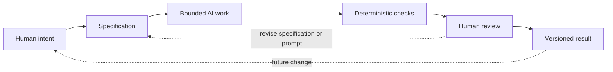

# Chapter 5: Directing AI with Meaning and Method

The first four chapters give us three lenses and one memorable test object. Persuasion asks how communication can help someone notice, trust, and act. Brand archetypes ask what role or identity a product is inviting someone to inhabit. Design language asks how that meaning should look and feel.

Together, these lenses form a high-level control framework for creative and technical work, including work made with an AI assistant. They do not replace craft or judgment. They help a person state what the work is for before asking a tool to produce it.

## Three Questions Before the Prompt

The framework can be remembered as three questions:

| Lens | Guiding question | Example for the white T-shirt |
| --- | --- | --- |
| Persuasion | What response are we trying to enable? | Help a careful buyer compare the shirt and decide with confidence. |
| Archetype | What meaning or identity are we expressing? | Present the buyer as thoughtful, independent, or cared for. |
| Design language | How should that meaning look and feel? | Use a clear grid, documentary images, or disruptive collage. |

These questions prevent a common mistake: asking for something that sounds polished but has no clear purpose. “Make a cool product page” leaves an AI assistant guessing about audience, response, meaning, evidence, and style. A better request names the desired response, the story behind it, and the visual or structural rules that should make the story recognizable.

The plain white T-shirt case study makes this visible. The product stays nearly constant, but “Pack less. Go farther,” “Nothing extra. Everything considered,” and “A basic with an argument” are not interchangeable messages. Each one points to a different audience, archetype, persuasive strategy, and visual world.

## From Idea to Specification

An AI assistant can generate quickly, but speed does not supply purpose. The human needs to bound the task with a specification: a compact description of what must be made, for whom, under which constraints, and how it will be checked.

A useful specification can include:

- **Objective:** What should exist at the end?
- **Audience:** Who will read, use, or judge it?
- **Response:** What should the audience understand, feel, or do?
- **Meaning:** What identity, value, or story should the work express?
- **Design language:** What tone, structure, imagery, or interaction should carry that meaning?
- **Constraints:** What must remain fixed, and what is outside the task?
- **Required output:** Which files, sections, links, or diagrams must be present?
- **Acceptance criteria:** What observable conditions will count as complete?

For example, “write a chapter about the shirt” is a weak specification. “Create a Markdown chapter with four distinct presentations of the same shirt; name the audience, archetype, persuasive principles, visual language, headline, story, imagery, meaning, and ethical risk for each; add a comparison table and a valid Mermaid diagram” is bounded. The second request gives an AI room to be inventive without making it responsible for inventing the assignment.

Specifications are not cages. They are handles. They give a person something concrete to inspect when the result is surprising or incomplete.

## The Complete AI-Assisted Workflow

The workflow is a loop, not a vending machine. A person states the intent, writes the boundary, and asks the AI to perform a limited task. Cheap automated checks catch simple failures. The person then reviews meaning, truthfulness, context, and quality before saving a version that can be identified and recovered later.

## Four Kinds of Confidence

The workflow works because different tools answer different questions.

### Specification: What was intended?

A specification is a human-readable agreement about scope and success. It makes hidden assumptions visible. It can say that the shirt must stay plain, that the chapter must avoid invented sources, or that the output belongs in one named Markdown file.

Without a specification, an AI result may be fluent and still be wrong for the assignment. Fluency is not the same as alignment.

### Deterministic checks: What is mechanically true?

Deterministic checks give the same answer when the same input is tested under the same conditions. They are useful for cheap, repeatable validation. A script can check that a required file exists, a Markdown heading is present, links point to expected files, or a Mermaid code fence opens and closes. A linter can flag malformed syntax. A word or pattern check can confirm that required sections were not accidentally omitted.

These checks are powerful because they do not get tired or distracted. They are also limited. A file can pass every presence check and still be boring, misleading, inaccessible, or conceptually confused.

### Probabilistic AI review: What seems plausible?

AI can be useful as a reviewer. It can compare a draft with a specification, point out repetition, suggest clearer headings, or identify a possible gap. But an AI review is probabilistic: its answer can vary with wording, context, model behavior, and the examples it notices. It may confidently miss a subtle factual error or praise a paragraph that does not serve the reader.

That makes AI review a second perspective, not a final authority. Ask it to show the evidence for a concern and compare its suggestions with the actual requirements.

### Human judgment: What should be accepted?

Humans remain responsible for judgment, meaning, truthfulness, context, and final decisions. A person decides whether an example is appropriate, whether a claim is supported, whether a design respects its audience, and whether the result actually communicates what was intended.

This responsibility matters especially when a generated result touches identity, culture, accessibility, safety, privacy, or reputation. No automated check can decide what a community would reasonably experience as respectful. No model can take responsibility away from the person submitting the work.

## Human Review as a Pit Stop

Think of an AI-assisted project as a race with planned pit stops. Automation can keep running through repeatable checks: file existence, formatting, links, headings, and other mechanical signals. Those checks keep the work moving.

But a race team still chooses moments for a deliberate inspection. During a pit stop, people look for what an instrument may not understand: a wrong tire, a damaged part, a strange sound, or a decision that no longer fits the conditions. Human review is similar. Pause at selected points to inspect the argument, the audience assumptions, the ethical risks, and the relationship between the prompt and the result.

The metaphor has an important limit: human review is not only a repair step after automation fails. It is also a design step before work begins and a judgment step before publication. The goal is not to inspect every character forever. It is to choose high-value moments for careful attention.

## Why Version Control Matters

AI-generated work can change quickly. A prompt may produce a new structure, a rewrite may remove a useful paragraph, or a later experiment may take the project in an unhelpful direction. Version control gives that movement a record.

Git matters for at least four reasons:

- **Traceability:** Commits show what changed, when it changed, and which issue or task it addressed.
- **Comparison:** A diff makes it possible to review the actual change instead of relying on memory.
- **Recovery:** Earlier versions remain available when an experiment makes the work worse.
- **Collaboration:** Branches and shared history let people review changes before they become the accepted result.

This is especially valuable when AI is involved because generation can feel authoritative while remaining easy to revise. A Git history turns revision into a visible sequence of decisions. It supports the human-in-the-loop principle: the person can inspect, reject, restore, and explain the work.

Version control is not proof that a result is good. It is a system that makes responsibility and recovery possible.

## A Reusable Prompt Pattern

The three lenses can be placed directly into an AI request:

> Create **[bounded output]** for **[audience]**. The response we want to enable is **[persuasion goal]**. Express the meaning of **[archetype or identity]**. Use **[design language]**. Keep **[fixed facts and constraints]** unchanged. Include **[required sections or features]**. Check the result against **[acceptance criteria]** and identify any uncertainty or ethical risk.

This pattern does not guarantee a perfect answer. It makes the important decisions visible before generation begins. It also gives the reviewer a useful checklist after the draft appears.

## Questions for Next Week

1. Where in your own work is the intended audience still vague?
2. What response do you want your next project to enable: attention, understanding, trust, participation, or action?
3. What archetype or identity is your project expressing, and what would be a misleading version of that story?
4. Which design-language choices would make the intended meaning easier to recognize?
5. What should be checked deterministically, and what requires human judgment?
6. What claim, image, or assumption deserves a deliberate pit stop before publication?
7. If an AI assistant produced a surprising result, what version-control step would let you investigate it safely?

## What You Should Remember

Persuasion asks what response we are trying to enable. Archetype asks what meaning or identity we are expressing. Design language asks how that meaning should look and feel. Together, the three lenses help turn a vague creative request into a purposeful brief.

AI works best inside a bounded specification. Deterministic checks handle cheap, repeatable facts. AI review can offer useful but probabilistic observations. Humans remain responsible for judgment, meaning, truthfulness, context, and final decisions. Git adds traceability, comparison, recovery, and a shared record of those decisions.

The practical lesson is simple: direct the tool, inspect the result, and keep the history. A fast generator is useful. A thoughtful process is what makes the generated work worth keeping.